# Splunk MCP Server - Mermaid Architecture Diagrams

This document contains interactive Mermaid diagrams that can be viewed in GitHub, VS Code (with Mermaid extension), or online at https://mermaid.live/

## 1. System Architecture Overview

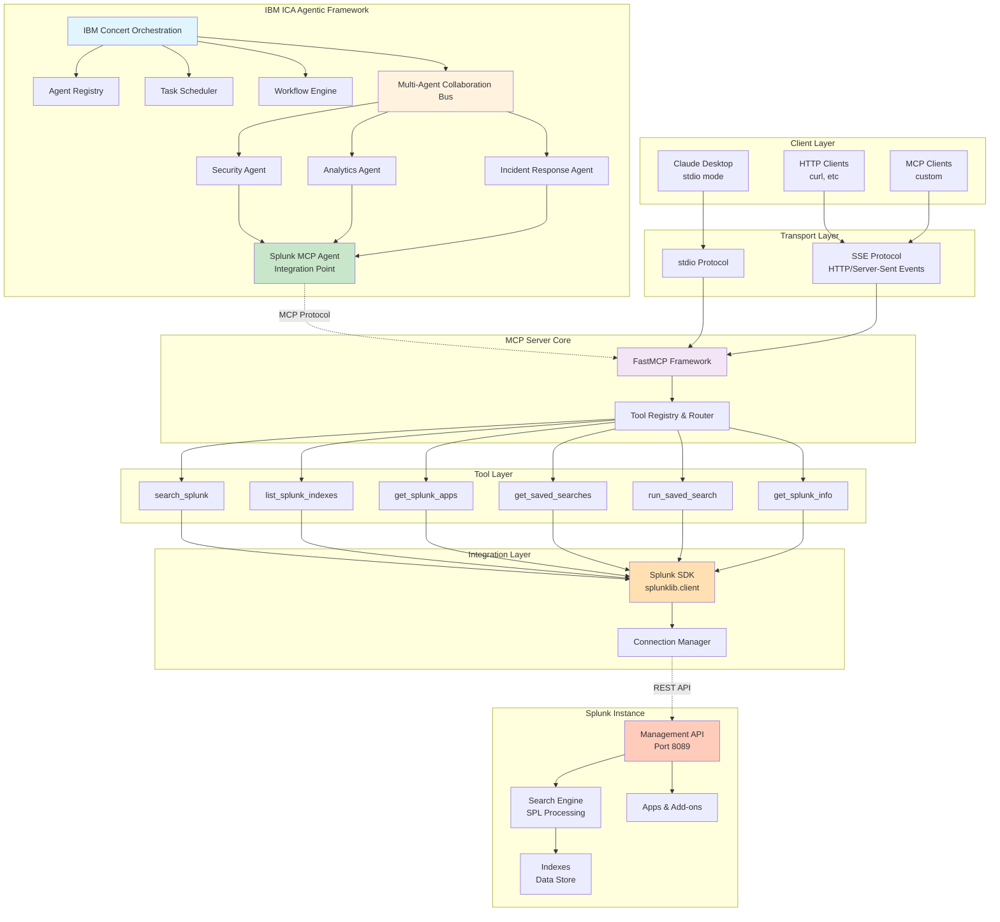

## 2. IBM ICA Agent Workflows

### Security Agent Workflow

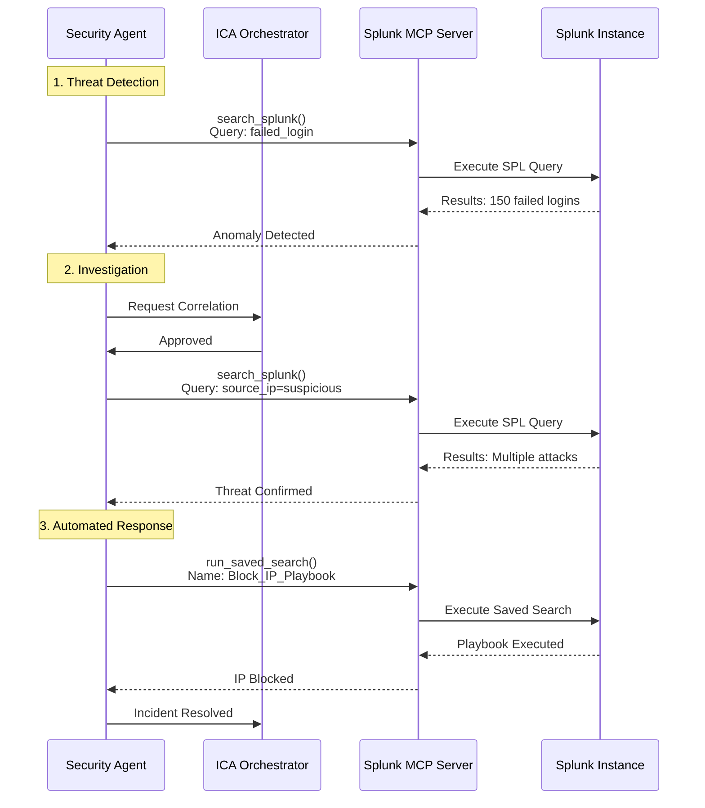

### Analytics Agent Workflow

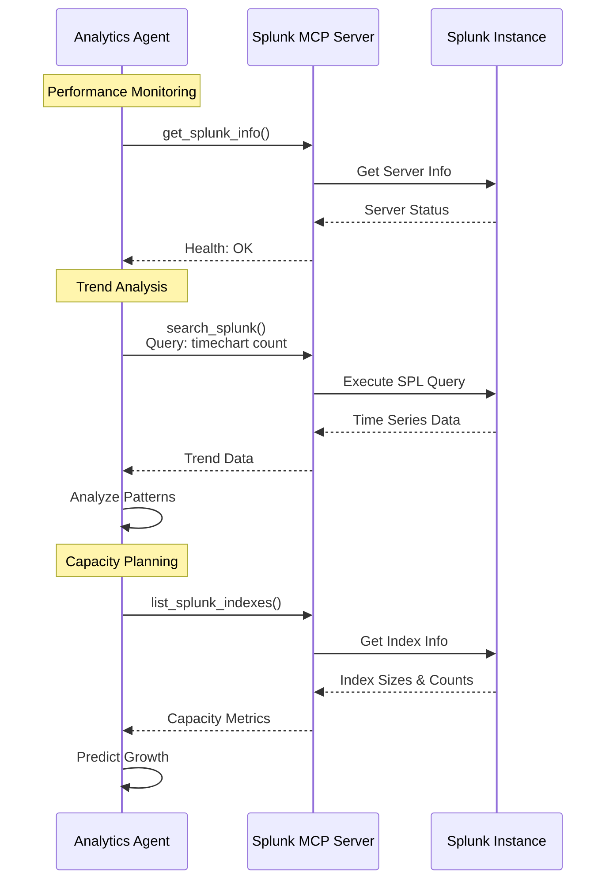

### Incident Response Agent Workflow

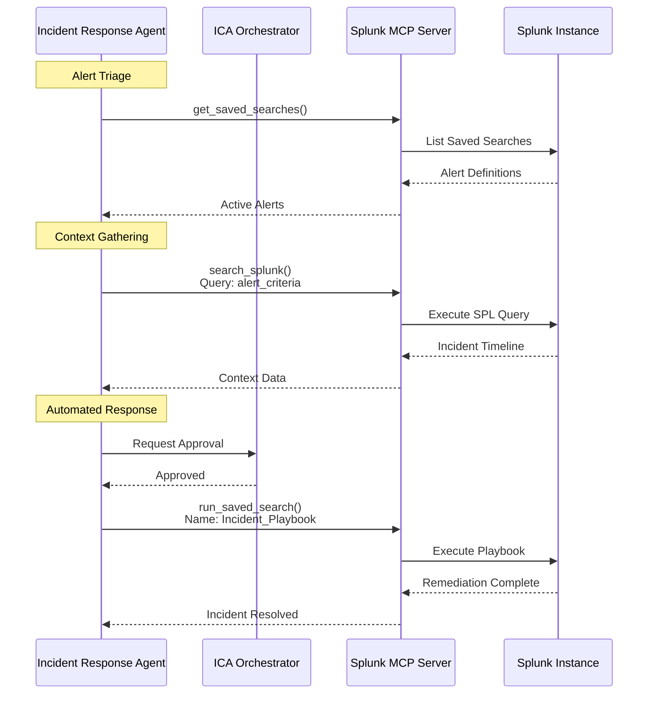

## 3. Multi-Agent Collaboration

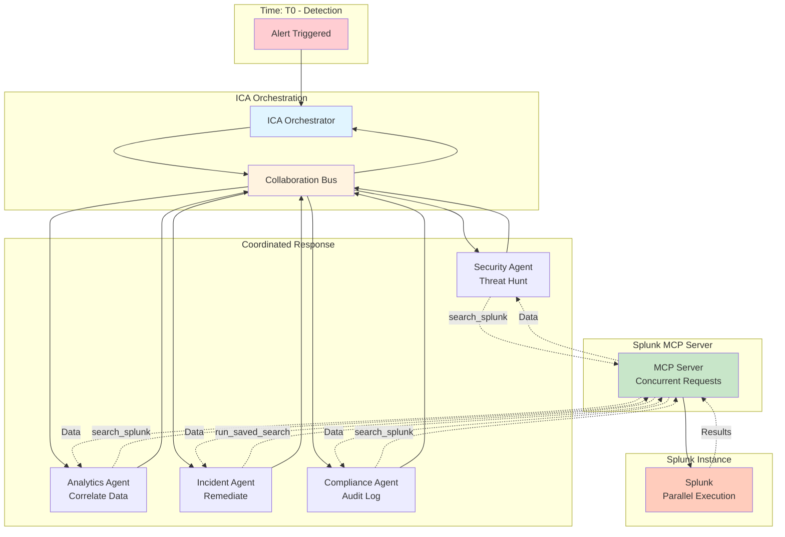

## 4. Data Flow - Search Query

```mermaid
flowchart LR
    USER[User/Agent<br/>Request]
    
    subgraph "Request"
        REQ[Search Query<br/>index=main error<br/>earliest=-1h]
    end
    
    subgraph "MCP Server"
        MCP[MCP Server<br/>Receive Request]
        TOOL[search_splunk<br/>Tool Handler]
    end
    
    subgraph "Splunk Integration"
        SDK[Splunk SDK<br/>Create Job]
        API[REST API<br/>POST /search/jobs]
    end
    
    subgraph "Splunk Processing"
        ENGINE[Search Engine<br/>Parse SPL]
        EXEC[Execute Query<br/>Scan Indexes]
        DATA[Fetch Data<br/>Apply Filters]
    end
    
    subgraph "Response"
        FORMAT[Format Results<br/>JSON]
        RETURN[Return to User<br/>100 events]
    end
    
    USER --> REQ
    REQ --> MCP
    MCP --> TOOL
    TOOL --> SDK
    SDK --> API
    API --> ENGINE
    ENGINE --> EXEC
    EXEC --> DATA
    DATA --> FORMAT
    FORMAT --> RETURN
    RETURN --> USER
    
    style USER fill:#e3f2fd
    style MCP fill:#f3e5f5
    style SDK fill:#fff3e0
    style ENGINE fill:#ffccbc
    style RETURN fill:#c8e6c9
```

## 5. Deployment Architecture

### Cloud Deployment (Render.com)

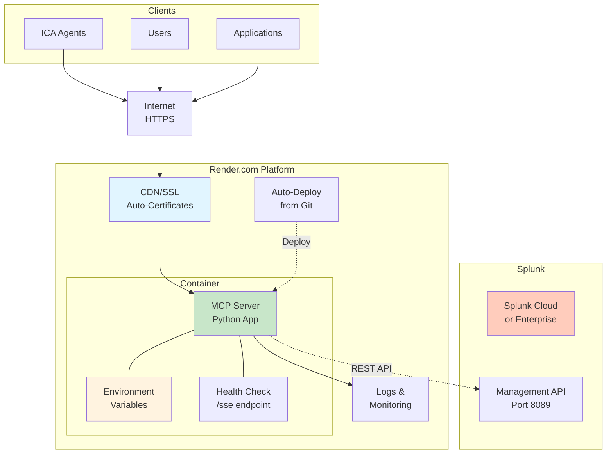

### Local Development

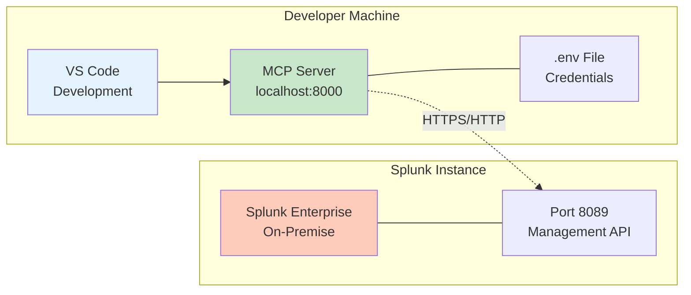

## 6. Tool Architecture

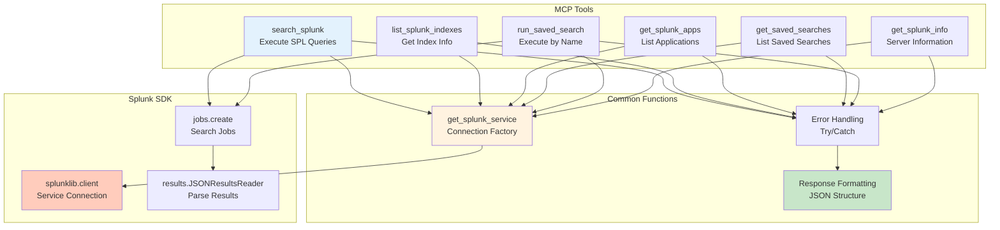

## 7. Security Architecture

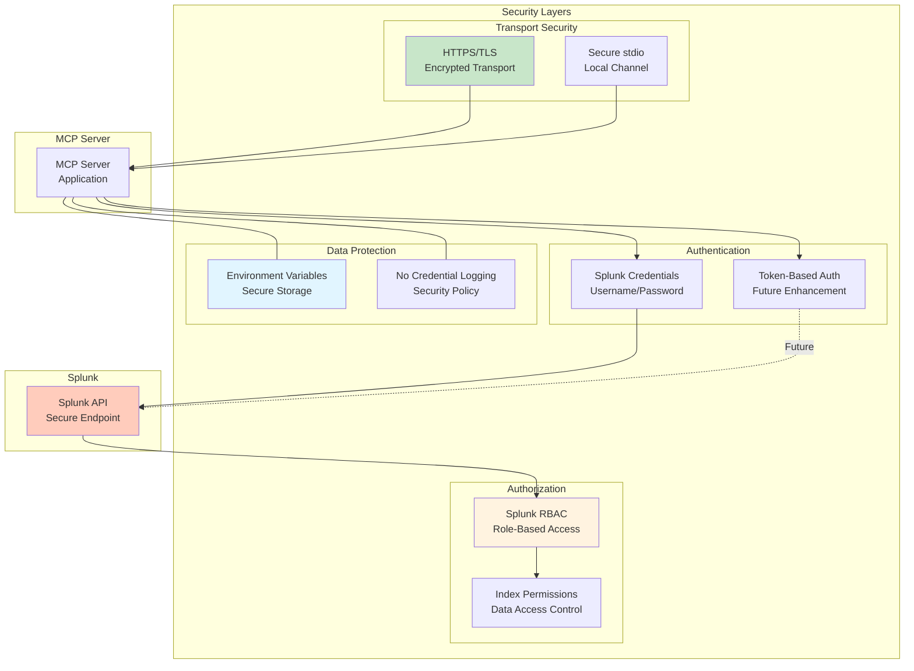

## 8. Integration Patterns

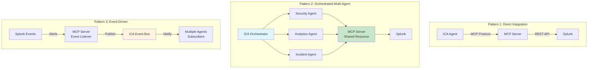

## How to View These Diagrams

### Option 1: GitHub (Automatic Rendering)
- Push this file to GitHub
- GitHub automatically renders Mermaid diagrams

### Option 2: VS Code
1. Install "Markdown Preview Mermaid Support" extension
2. Open this file
3. Press `Cmd+Shift+V` (Mac) or `Ctrl+Shift+V` (Windows/Linux)

### Option 3: Mermaid Live Editor
1. Visit https://mermaid.live/
2. Copy any diagram code
3. Paste and view/edit interactively
4. Export as PNG or SVG

### Option 4: Export to Images
```bash
# Install mermaid-cli
npm install -g @mermaid-js/mermaid-cli

# Convert to PNG
mmdc -i MERMAID_DIAGRAMS.md -o mermaid_output.png
```

## Diagram Features

- ✅ **Interactive**: Clickable and zoomable
- ✅ **Scalable**: Vector-based, crisp at any size
- ✅ **Editable**: Easy to modify and update
- ✅ **Version Control**: Text-based, perfect for Git
- ✅ **Multiple Formats**: Can export to PNG, SVG, PDF
- ✅ **Responsive**: Adapts to different screen sizes
- ✅ **Professional**: Clean, modern appearance

These Mermaid diagrams provide a comprehensive visual representation of the Splunk MCP Server architecture integrated with IBM ICA Agentic Framework!